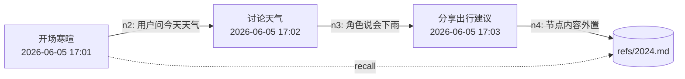

# PRD: v2.0「TencentDB Agent Memory 4 层渐进式记忆」

> Generated: 2026-06-05 18:00
> Type: Refactor + Feature | Priority: P0 | Est: 24h
> Reference: <https://github.com/Tencent/TencentDB-Agent-Memory>

## 1. 目标

把「独白匣」当前单一的 `long_term_memory/memory_<id>.md` 长久记忆逻辑，替换为 **TencentDB Agent Memory** 的 **4 层渐进式记忆架构**，并复用其「Mermaid 符号化短时压缩」降低长对话 token 消耗。

最终效果（对齐腾讯设计目标）：
- **L3 Persona**（人物画像）：跨会话、跨角色复用，体现用户偏好、说话风格、长期目标。
- **L2 Scenario**（场景块）：按主题聚合，描述该角色下的剧情线 / 反复出现的场景。
- **L1 Atom**（原子事实）：从对话中抽取的事实条目，时间戳、来源消息。
- **L0 Conversation**（原始对话）：本地 Room 数据库里的消息流 + 旁路 `refs/<messageId>.md` 长文摘录。
- **Short-term canvas**：当前对话的 Mermaid 任务/剧情画布，超长历史外置为 `refs/*.md`，按 `node_id` 钻取。

每次发消息时按需注入：L3 Persona + L2 Scenario 摘要（短）+ L1 命中事实（按语义） + 当前对话 Short-term canvas（短），可下钻到 L0 / refs。

## 2. 设计依据（来自 TencentDB-Agent-Memory README）

> TencentDB Agent Memory 通过 4 层渐进式管道为 AI Agent 提供完全本地的长期记忆，零外部 API 依赖。
>
> - **Symbolic short-term memory**：将冗长的工具日志压缩成 Mermaid 符号画布，节省 token 并提升任务成功率。
> - **Layered long-term memory**：把碎片化对话提炼为结构化的 Persona / Scene，**避免** 平铺向量堆。
> - 集成后：WideSearch 成功率 33% → 50%（+51.52%），tokens 减少 61.38%；PersonaMem 准确率 48% → 76%。
> - **Heterogeneous storage**：底层（L0 / L1 / 日志）持久化到数据库，全文检索；上层（L2 / L3 / canvas）落盘为人类可读的 Markdown 文件，便于白盒审查。
> - **Full traceability**：保留 L3 → L2 → L1 → L0 的下钻路径。

## 3. 范围与不做清单

### MVP 包含
- 新增包 `com.example.chatbot.memory`，下含 4 层 Manager + 短时压缩 + 检索。
- 角色级 `memory/<characterId>/` 目录：
  - `persona.md`（L3）
  - `scenarios/*.md`（L2，每场景一文件）
  - `atoms.jsonl`（L1，每行一个原子事实）
  - `short_term_canvas.md`（Mermaid 画布）
  - `refs/<messageId>.md`（L0 长文摘录，按需生成）
- 顶层 `memory/persona_global.md`（L3 跨角色通用偏好，源自全部角色的 L2 聚类）。
- 每次成功聊天结束触发 L1 抽取（每 N 轮 / 累积 M 条未抽取消息时跑一次），不阻塞 UI。
- 每次 L1 抽取到一定量（默认 50 条）后异步跑一次 L2 场景聚类 + L3 Persona 增量。
- 每次发消息前，构造 system prompt：
  ```
  【Persona】 <persona_global + character_specific persona>
  【Active Scenarios】 <top-K 命中 L2 摘要>
  【Relevant Facts】 <语义/关键词命中的 L1 原子>
  【Conversation Canvas】 <short_term_canvas.md 内容>
  ```
- 短时压缩：发送消息时若历史 token 估算 > mildOffloadRatio（默认 0.5×上下文）→ 把更早的整段对话外置到 `refs/<messageId>.md`，并在画布里只保留节点 + `node_id`；若 > aggressiveCompressRatio（0.85）→ 进一步把节点标题化。
- 备份恢复：`backup.zip` 内 `memory/` 目录同时打包 L0 / L1 / L2 / L3 + 短时画布。

### MVP 不包含（保留占位，留待 v2.1+）
- 自动 Skill 抽取（TencentDB 路线图中的 skill generation）。
- 跨设备实时同步、记忆导入导出可视化 UI（仅做 zip 内的白盒打包/恢复）。
- 远端 embedding API 配置入口（仅做本地 ONNX；如需可后续扩展）。
- Mermaid 画布的可视化渲染（v1 先把画布作为文本注入 prompt，等 v2.1 单独 Story 渲染）。

## 4. 数据模型

### 4.1 文件落盘结构（md 优先）
```
<filesDir>/memory/
  persona_global.md                        # L3 跨角色用户画像
  global_state.json                        # 索引：persona_global 元数据 + atom 计数 + 上次 L2/L3 时间
  characters/
    <characterId>/
      persona.md                           # L3 角色专属画像
      short_term_canvas.md                 # Mermaid 画布
      canvas_state.json                    # 画布元数据：最近更新、关联 messageId 范围
      scenarios/
        <scenarioId>.md                    # L2 场景：标题、摘要、关键 atom_id 列表
      atoms/
        atoms.jsonl                        # L1 原子事实（每行一条 JSON）
        atoms_index.sqlite                 # sqlite-vec 向量索引（KNN 用）
        atoms_meta.json                    # 原子计数器 / 上次聚类时间
      refs/
        <messageId>.md                     # L0 长文摘录（按需外置）
      l0_cache/
        <yyyy-MM-dd>.md                    # L0 滚动原始对话缓存（每天一文件）
```

### 4.2 原子事实（atoms.jsonl 行结构）
```json
{
  "id": "atom_<uuid>",
  "characterId": 1,
  "scenarioId": "scn_<uuid>",
  "ts": 1717560000000,
  "type": "fact" | "preference" | "event" | "emotion",
  "subject": "user" | "character" | "third_party",
  "text": "用户在 6/3 提到自己养了一只橘猫",
  "sourceMessageIds": [1024, 1025],
  "ref": "optional path to refs/...md"
}
```

### 4.3 场景块（scenarios/<id>.md）
```markdown
<!--
id: scn_xxx
characterId: 1
title: 关于「橘猫阿肥」的日常
createdAt: 2026-06-01T10:00:00Z
updatedAt: 2026-06-04T22:30:00Z
atomCount: 12
-->

# 关于「橘猫阿肥」的日常

## 摘要
用户养了一只叫「阿肥」的橘猫，每天会分享阿肥的日常……

## 关键事实
- 用户在 6/3 提到自己养了一只橘猫
- 6/4 用户说阿肥今天打翻了水杯

## 相关对话节点
- node_id: n12 → 6/3 14:22 「我刚给阿肥拍了个照」
```

### 4.4 Persona
```markdown
<!--
level: L3
scope: global | character
characterId: 1 | null
updatedAt: 2026-06-04T22:30:00Z
drillDown: ["scn_xxx", "scn_yyy"]
-->

# Persona

## 基本信息
- 称呼：用户偏好被叫「小安」
- 时区：Asia/Shanghai

## 沟通风格
- 喜欢简短、有梗、偶尔夹英文
- 不喜欢长篇抒情

## 长期目标
- 准备雅思 7 月考试

## 偏好
- 猫 > 狗
- 咖啡只喝美式

## 关联场景
- [关于「橘猫阿肥」的日常](scenarios/scn_xxx.md)
```

### 4.5 Mermaid Short-term Canvas


> 节点 n1…nN 与 messages 1:1 对应；外置的整段对话放 `refs/<yyyy-MM-dd>.md` 中。

### 4.6 Room 扩展
新增一张 `embedding_cache` 表（仅记录元数据，向量本体在 `atoms_index.sqlite`）：

| 字段 | 类型 | 说明 |
|------|------|------|
| atomId | TEXT PK | 与 atoms.jsonl 对齐 |
| characterId | INT | 角色 ID |
| embeddingModel | TEXT | 使用的模型版本 |
| dim | INT | 维度 |
| lastHit | LONG | 最近一次被召回时间 |

## 5. 模块拆分（新增 / 改造）

### 5.1 新增
| 类 | 职责 |
|----|------|
| `memory/MemoryPaths` | 统一拼路径：`filesDir/memory/...` |
| `memory/MemoryConfig` | 读取 / 写入 `memory_config` SharedPreferences，存储开关、阈值、embed 模型名等 |
| `memory/MemoryPipeline` | 顶层 Orchestrator：调度 L1 抽取 / L2 聚类 / L3 更新 / 短时压缩 |
| `memory/L0ConversationStore` | 滚动缓存 L0 原始对话（按天写文件）；`refs/*.md` 外置 |
| `memory/L1AtomExtractor` | 调用 LLM 把增量消息提炼为原子事实，写 `atoms.jsonl` + sqlite-vec |
| `memory/L2ScenarioClusterer` | 周期性把 L1 atoms 聚类成场景；维护 `scenarios/*.md` |
| `memory/L3PersonaUpdater` | 跨角色（global）+ 角色级（character）Persona 更新 |
| `memory/ShortTermCanvas` | 维护 `short_term_canvas.md` + 节点 / 外置规则 |
| `memory/MemoryRetriever` | 召回：BM25（关键词）+ sqlite-vec KNN + RRF 融合，按 R / L2 摘要 / L3 排序后返回 |
| `memory/PromptBuilder` | 按 TencentDB 规范拼 system 消息 |
| `memory/embed/LocalEmbedder` | 本地 ONNX/MNN embedding 接口 |
| `memory/embed/OnnxEmbedder` | ONNX Runtime 实现（默认 bge-small-zh-v1.5 量化版） |
| `memory/vec/VecIndex` | sqlite-vec KNN 包装：open / upsert / search |

### 5.2 改造
| 文件 | 改造点 |
|------|--------|
| `util/LongTermMemoryManager.kt` | 标记 `@Deprecated`，内部委托到 `MemoryPipeline`，老 API 保持签名不变以减少回归。 |
| `viewmodel/ChatViewModel.kt` | `sendMessage` 前调 `PromptBuilder.build(characterId, userMsg)` 拼四层；发消息后触发 `MemoryPipeline.onTurnComplete(...)`。 |
| `viewmodel/ChatViewModel.kt` | 取消「每日首次进入聊天页强制整段摘要」的逻辑（被新管线取代）。 |
| `util/BackupManager.kt` | `memories/` 目录按角色子目录打包；兼容旧版 `memory_<id>.md` 平铺作为 v3 → v4 兼容包。 |
| `database/AppDatabase.kt` | 升级 version 5→6，迁移加 `embedding_cache` 表；并把备份版本号升到 4。 |
| `App.kt` | 在 `onCreate` 中初始化 `MemoryPipeline`（异步预热 embedder / vec index）。 |
| `ui/setting/fragment_setting.xml` + `SettingFragment.kt` | 新增「长久记忆 4 层」开关、画布阈值滑条、embed 模型状态。 |
| `ui/character/AddCharacterDialog.kt` | 角色编辑页「长期记忆」开关旁增加「下钻查看 / 重置该角色记忆」按钮。 |
| `app/build.gradle` | 新增 `onnxruntime-android`、`sqlite-vec-android`（AAR 形式本地引入，详见 §7）。 |
| `local.properties` | 增加 `MEMORY_EMBED_MODEL_PATH`（默认指向 app assets 里的 bge-small-zh）。 |

### 5.3 删除/废弃
- `LongTermMemoryManager.generateSummaryInitial` / `generateSummaryUpdate` → 标记 deprecated，内部转调 `MemoryPipeline`。
- `LongTermMemoryManager` 单一 `memory_<id>.md` 文件 → 自动迁移：启动时检测 `filesDir/long_term_memory/`，将旧内容当作 L2 摘要迁移进 `memory/characters/<id>/persona.md`，并迁移 `last_message_timestamp` 到 `canvas_state.json`。

## 6. Pipeline 触发节奏

| 触发 | 行为 | 阻塞？ |
|------|------|--------|
| 角色对话成功 1 轮 | 写 L0 当天缓存；更新 Mermaid 画布（追加节点 / 检测外置） | 否 |
| 累积未抽取消息 ≥ 5 | L1 抽取（LLM 调一次） | 否 |
| 同一角色 L1 atoms ≥ 50 | L2 聚类（LLM 调 1–N 次） | 否 |
| 任何角色 L1 atoms 总数变化 ≥ 50 | L3 global Persona 更新（LLM 调 1 次） | 否 |
| 进入聊天页首次 | 调 `MemoryRetriever.recall(query=userRecentSummary)` 预热 | 否 |
| 发送用户消息前 | `PromptBuilder.build(characterId, userMsg, charPrompt)` | 是，但本地 < 50ms |
| 角色总数变化 | 重新评估 embedder 是否需要重启（无需重启，线程安全即可） | 否 |

并发约束：同角色串行；不同角色并发；L1/L2/L3 全局串行，避免同写同文件。

## 7. 依赖与体积控制

- **ONNX Runtime Android**：`com.microsoft.onnxruntime:onnxruntime-android:1.17.1`（约 8 MB 各 ABI）
- **embed 模型**：`bge-small-zh-v1.5` int8 量化（约 47 MB），app 内置 `assets/models/bge-small-zh-v1.5-int8.onnx`；首次启动时复制到 `filesDir/models/`。
- **sqlite-vec**：使用预编译 AAR 形式，本地放 `third_party/sqlite-vec-android/`，通过 `flatDir` 引入；如不可达，回退到 `faiss-android` 进程内索引或纯 BM25（保留插件位）。
- **存储预算**：单角色 1 年连续对话预估 ≤ 5 MB（画布 + atoms + refs + 1KB 嵌入）。

> 体积红线：APK 增量不超过 60 MB（int8 模型 + 2 个 ABI 的 .so）。如超出再讨论拆分 .obb 或运行时下载。

## 8. 设置页 / 角色编辑页 UI 调整

- 设置页「记忆设置」卡片下新增：
  - 「4 层记忆」开关（默认开）
  - 「画布外置阈值」滑条（0.3 – 0.9，默认 0.5）
  - 「embedding 状态」只读文本：未初始化 / 就绪 / 模型缺失
  - 「查看/导出记忆」按钮：进入只读 `MemoryViewerActivity`，可看 L3 / L2 / L1 / canvas
- 角色编辑页「长期记忆」开关旁：
  - 「记忆层级状态」副标题（最近一次 L1 / L2 / L3 时间）
  - 「重置该角色记忆」按钮（清空 `memory/characters/<id>/`，不可恢复）

## 9. 验收标准

- [ ] 角色可单独启用 4 层记忆；新对话空状态自动初始化目录与空 persona.md
- [ ] 至少对话 6 轮后，L1 atoms 出现；50 轮后出现 L2 scenarios
- [ ] 跨任意角色累计 50 个 atoms 后，全局 L3 persona.md 被更新
- [ ] 长对话（> 50 轮）后，画布节点减少，refs/ 下出现外置长文
- [ ] 关键词 / 语义召回均可用；system prompt 在 settings 调试页可看
- [ ] 备份 zip 包含 4 层目录；旧备份（v3）可恢复，新内容自动迁移
- [ ] 卸载重装后（保留 backup.zip 恢复）4 层目录可完整还原
- [ ] Debug APK 在 minSdk 26 真机上启动到设置页 < 5s

## 10. 风险

- 旧 `memory_<id>.md` 迁移失败：保留 `LongTermMemoryManager` 的旧 API 6 个月，前端只暴露新 UI。
- ONNX 模型体积大：int8 已控制，APK 超过 80MB 时改为运行时下载。
- sqlite-vec AAR 来源问题：若 Maven 仓库无该 AAR，回退为 `faiss-android` 或进程内 ANN；编码层面 `VecIndex` 抽象接口不变。
- 召回注入 prompt 后，部分小模型在 system 过长时掉性能：`recall.maxTotalRecallChars` 默认 2400，配合 `maxCharsPerMemory` 限制单条。

---

**状态**：待开发
*Generated based on iteration plan v2.0 (2026-06-05)*
